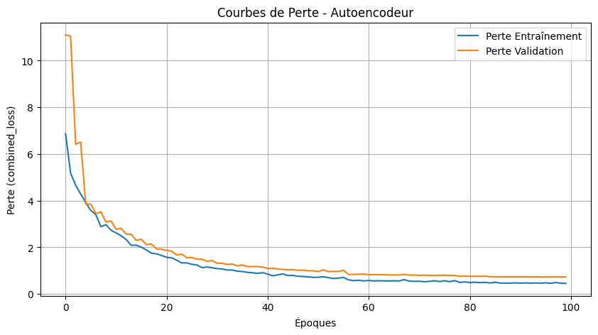
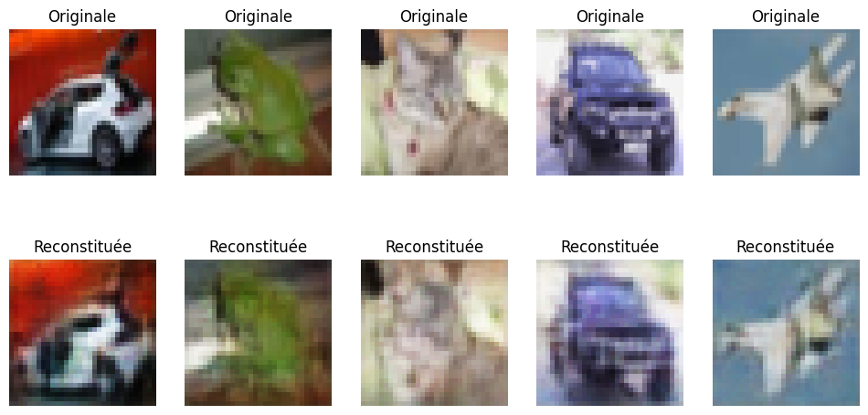

# CIFAR10-CompressAI


## Description

**CIFAR10-CompressAI** is a project implementing a convolutional autoencoder for compressing and reconstructing images from the CIFAR-10 dataset. The autoencoder is trained using a combination of perceptual loss and MSE loss, providing efficient compression while preserving the quality of reconstructed images.

<div style="display: flex; justify-content: center;">
    
    
</div>

## Features

- **Efficient Compression**: Utilizes a convolutional autoencoder to reduce the size of CIFAR-10 images.
- **High-Quality Reconstructions**: Combines perceptual loss and MSE loss to maintain the quality of reconstructed images.
- **Data Augmentation**: Advanced techniques to enhance the model's robustness.
- **GPU Support**: Optimized for training on GPUs with TensorFlow.
- **Modularity**: Code organized into modules to facilitate contributions and extensions.

## Project Structure

```
CIFAR10-CompressAI/
├── data/                  # Folder for data
├── models/                # Storage for trained models and images
├── notebooks/             # Jupyter notebooks for exploration
├── src/                   # Source code
│   ├── data_preprocessing.py
│   ├── models.py
│   ├── train.py
│   ├── evaluate.py
├── .gitignore             # Files and folders to ignore by Git
├── README.md              # Project documentation
├── requirements.txt       # Project dependencies
├── LICENSE                # Project license
├── CONTRIBUTING.md        # Contribution guide
```

## Installation

1. **Clone the Repository**

    ```bash
    git clone https://github.com/pierridotite/CIFAR10-CompressAI.git
    cd CIFAR10-CompressAI
    ```

2. **Create a Virtual Environment (Optional but Recommended)**

    ```bash
    python -m venv venv
    venv\Scripts\activate      # On Windows
    source venv/bin/activate   # On macOS/Linux
    ```

3. **Install Dependencies**

    ```bash
    pip install -r requirements.txt
    ```

## Usage

### Training the Model

To train the autoencoder, run:

```bash
python src/train.py
```

### Evaluating the Model

To evaluate and compare the original and reconstructed images, run:

```bash
python src/evaluate.py
```

## Contribution

Contributions are welcome! Please refer to the [CONTRIBUTING.md](CONTRIBUTING.md) file for more details.

## License

This project is licensed under the MIT License. See the [LICENSE](LICENSE) file for more details.

## Examples

### Training


### Compression Comparison


## Advanced Usage

You can explore the notebooks in the `notebooks/` folder for additional analyses and visualizations.

---

Thank you for using **CIFAR10-CompressAI**! Feel free to contribute and share this project with the community.